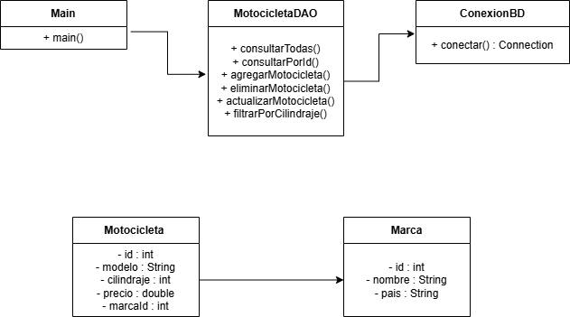

# Catálogo de Motocicletas

Proyecto desarrollado en Java utilizando PostgreSQL y Neon Database.

## Descripción

Este sistema permite administrar un catálogo de motocicletas mediante operaciones CRUD.

El proyecto fue desarrollado usando:
- Java
- Maven
- PostgreSQL
- Neon Database
- JDBC
- IntelliJ IDEA

---

## Funcionalidades

- Consultar motocicletas
- Consultar motocicleta por ID
- Agregar motocicletas
- Eliminar motocicletas
- Actualizar motocicletas
- Filtrar por cilindraje
- Menú interactivo por consola

---

## Tecnologías utilizadas

- Java 17
- Maven
- PostgreSQL
- Neon Tech
- JDBC

---

## Estructura del proyecto

src/main/java

- database
- dao
- model
- service

---

## Base de datos

La base de datos se encuentra alojada en Neon PostgreSQL.

Tablas utilizadas:
- marca
- motocicleta

---

## Diagrama UML

---

## Autor

Sergio Pulido